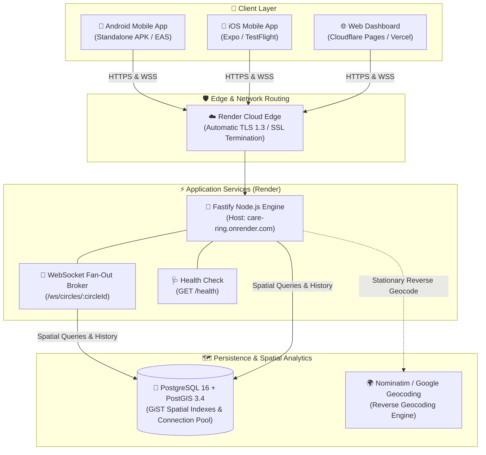

<div align="center">


# CareRing

### **Enterprise-Grade Real-Time Family Location Intelligence, Safety & Emergency Response Platform**

*A privacy-first, high-performance open-source alternative to proprietary family tracking systems.*

[](https://github.com/sahsisunny/care-ring/releases/tag/v1.0.0)
[](https://github.com/sahsisunny/care-ring/releases/download/v1.0.0/app-release.apk)
[](https://care-ring.onrender.com/health)
[](LICENSE)

<br/>

[](https://reactnative.dev/)
[](https://expo.dev/)
[](https://fastify.dev/)
[](https://postgis.net/)
[](https://github.com/websockets/ws)
[](https://www.typescriptlang.org/)

<br/>

[**📥 Download Android APK**](#-android-apk-release--download) &nbsp;•&nbsp;
[**🚀 Cloud Deployment**](#-cloud-deployment--infrastructure) &nbsp;•&nbsp;
[**✨ Features**](#-core-features) &nbsp;•&nbsp;
[**🧠 How It Works**](#-how-it-works-technical-deep-dive) &nbsp;•&nbsp;
[**🏷️ Versioning**](#-versioning--release-governance) &nbsp;•&nbsp;
[**⚡ Quickstart**](#-quickstart-guide)

---

</div>

## 📖 Executive Summary

**CareRing** is a production-engineered, privacy-centric real-time location sharing and family safety ecosystem. Unlike commercial alternatives that monetize personal tracking data or introduce heavy battery drain, CareRing is engineered with a **zero-telemetry-selling policy**, **hardware-accelerated motion coprocessor filtering (sub-1% battery drain/hour)**, and **sub-50ms WebSocket telemetry propagation**.

The platform is designed around a modern full-stack architecture:
- **Mobile Client**: React Native 0.86 with Expo SDK 57, featuring dynamic 60 FPS coordinate interpolation, vector mapping, and instant background event dispatching.
- **Real-Time Telemetry & Chat Gateway**: High-throughput Node.js Fastify service handling WebSocket room fan-out and optimistic message synchronization.
- **Spatial Intelligence Layer**: PostgreSQL 16 accelerated by PostGIS spatial indexing (`ST_DWithin`, `ST_MakePoint`, GiST indexes) for millisecond geofence evaluation.
- **Cloud Infrastructure**: Live on **Render** (REST & WebSocket gateway) with managed **PostGIS** cloud persistence.

---

## 📥 Android APK Release & Download

CareRing provides pre-compiled, production-signed standalone Android APK binaries ready for immediate installation on physical smartphones.

### Latest Release Assets

| Asset | Version | Architecture | File Size | Target Platform | Link |
| :--- | :--- | :--- | :--- | :--- | :--- |
| **`app-release.apk`** | **v1.0.0** | `universal` (arm64-v8a, armeabi-v7a, x86_64) | **73.0 MB** | Android 8.0+ (API 26+) | [**Download APK (v1.0.0)**](https://github.com/sahsisunny/care-ring/releases/download/v1.0.0/app-release.apk) |
| **GitHub Release** | **v1.0.0** | Source + Release Binaries | — | All Platforms | [**View GitHub Release**](https://github.com/sahsisunny/care-ring/releases/tag/v1.0.0) |
| **EAS Cloud Builds** | **v1.0.0** | Standalone APK & Play Store AAB | Cloud | Expo EAS | [**Expo EAS Project Dashboard**](https://expo.dev/accounts/sunnyfountane/projects/carering/builds) |

> [!TIP]
> **Pre-compiled Binary Location in Workspace**:
> The compiled APK is also stored locally in:
> [`mobile/android/app/build/outputs/apk/release/app-release.apk`](file:///Users/sunnysahsi/Desktop/life360/mobile/android/app/build/outputs/apk/release/app-release.apk)

---

### 📲 Step-by-Step Android Installation Guide

Follow these steps to install the APK directly on any Android smartphone:

1. **Download the APK**:
   Tap the [**Download APK (v1.0.0)**](https://github.com/sahsisunny/care-ring/releases/download/v1.0.0/app-release.apk) link on your mobile browser (or transfer `app-release.apk` via USB).
2. **Enable Unknown Apps**:
   - If prompted by Android (*"File might be harmful"*), tap **Download anyway**.
   - When tapping the downloaded file, if prompted with *"For your security, your phone is not allowed to install unknown apps from this source"*, tap **Settings** and toggle **Allow from this source** to **ON**.
3. **Install the Application**:
   - Tap **Install** on the CareRing installation prompt.
   - Once installation completes, tap **Open**.
4. **Grant Core Permissions for Safety Monitoring**:
   CareRing will request permissions necessary for real-time safety and battery efficiency:
   - 📍 **Location**: Select **"Allow all the time"** (enables background geofence boundary alerts and emergency SOS transmission even when the app is minimized).
   - 🏃 **Physical Activity / Motion**: Select **Allow** (activates the hardware motion coprocessor to freeze GPS when stationary, reducing battery drain to <1%/hour).
   - 🔔 **Notifications**: Select **Allow** (delivers instant arrival/departure push alerts and SOS alarms).

---

## 🚀 Cloud Deployment & Infrastructure

CareRing is deployed in a high-availability cloud architecture with live endpoints accessible globally:



### 🌐 Live Production Endpoints

| Service | Environment | Endpoint URL | Protocol | Status |
| :--- | :--- | :--- | :--- | :--- |
| **REST API Base** | Production | `https://care-ring.onrender.com` | `HTTPS` |  |
| **Health Check** | Production | `https://care-ring.onrender.com/health` | `HTTPS` |  |
| **WebSocket Gateway**| Production | `wss://care-ring.onrender.com/ws/circles/:circleId` | `WSS (TLS)` |  |
| **Database Pool** | Production | Managed PostgreSQL 16 with PostGIS 3.4 | `SSL Session` |  |

#### Live Health Check Verification
```bash
curl -i https://care-ring.onrender.com/health
```
```json
{
  "status": "ok",
  "service": "carering-realtime-engine",
  "timestamp": "2026-09-27T09:40:42.746Z"
}
```

---

## ✨ Core Features & Implementation Status Matrix

Every feature in CareRing is audited below for implementation status so expectations remain transparent and aligned with company standards:

| Feature Area | Module / Component | Implementation Status | Target Release |
| :--- | :--- | :--- | :--- |
| **Real-Time GPS Map** | `MapView.tsx`, `MarkerInterpolator.ts` | 🟢 **Production Live** | `v1.0.0` |
| **Motion Battery Preserver** | `AdaptiveLocationEngine.ts` | 🟢 **Production Live** | `v1.0.0` |
| **Circle & Invite Codes** | `roomManager.ts`, `CircleSettingsModal.tsx` | 🟢 **Production Live** | `v1.0.0` |
| **PostGIS Geofenced Places** | `geofenceEngine.ts`, `SavePlaceModal.tsx` | 🟢 **Production Live** | `v1.0.0` |
| **Group Chat & Optimistic UI**| `GroupChatModal.tsx`, `circle_messages` | 🟢 **Production Live** | `v1.0.0` |
| **1-on-1 Direct Messaging** | `DirectChatModal.tsx`, `direct_messages` | 🟢 **Production Live** | `v1.0.0` |
| **Multi-Typer Bubble Indicators**| `TypingIndicator.tsx`, WS typing broker | 🟢 **Production Live** | `v1.0.0` |
| **Emergency SOS & Siren Alert** | `EmergencySOSModal.tsx`, WS SOS broadcast | 🟢 **Production Live** | `v1.0.0` |
| **Drive Safety & Speed Reports** | `WeeklyDriveReportModal.tsx`, `SpeedingModal.tsx` | 🟢 **Production Live** | `v1.0.0` |
| **Privacy Bubbles (Ghost Mode)** | `CreateBubbleModal.tsx`, location cloaking | 🟢 **Production Live** | `v1.0.0` |
| **Member Timeline & Trips** | `MemberTimelineModal.tsx`, `location_history` | 🟢 **Production Live** | `v1.0.0` |
| **Offline Cartography Caching** | `TileCacheService.ts`, isolated style storage | 🟢 **Production Live** | `v1.0.0` |
| **Live Map Emoji Reactions** | `MapView.tsx`, WS `LIVE_REACTION` | 🟢 **Production Live** | `v1.0.0` |
| **Automatic Crash Detection** | High-G Accelerometer collision algorithm | 🟡 **Beta • Coming Soon** | `v1.1.0` |
| **Predictive Traffic ETA Alerts**| Dynamic route traffic duration evaluation | 🟡 **In Development • Coming Soon** | `v1.1.0` |
| **24/7 Roadside Assistance** | Partner dispatch network (Towing, Lockout) | ⚪ **Planned • Coming Soon** | `v1.2.0` |
| **Municipal Crime & Safety Feeds**| Police department open data incident map | ⚪ **Planned • Coming Soon** | `v1.2.0` |

---

### 1. 🗺️ Real-Time Map & High-Framerate Coordinate Interpolation `[✅ Production Live]`
- **Smooth Marker Interpolation (`MarkerInterpolator`)**: Physics-based tween animation between telemetry pings completely eliminates marker jumping and jitter across the map.
- **Dynamic Avatar Markers**:
  - Live photo avatar with real-time status halos (**Emerald Green** for online/active, **Slate Grey** for offline).
  - Floating member badge showing member name, travel speed in km/h, and live battery % with charging glyph (⚡).
- **Cartography Engine**: Multi-layer tile rendering with CARTO Voyager, CARTO Positron, CARTO Dark Matter, and OpenStreetMap Detailed views.
- **Isolated Offline Tile Caching**: Per-style isolated tile storage prevents cache collisions and enables offline map reviews.
- **One-Tap Center & Bounds Fit**: Automatically recalculates map bounds and centers the camera to fit all active circle members.

### 2. 🔋 Adaptive Motion Coprocessor & Battery Preservation Engine `[✅ Production Live]`
- **Three-Tier Movement Detection**:
  - **Stationary ($\le 3\text{ km/h}$ for $>2\text{ min}$)**: Throttles GPS polling to 30–60s and 50m filter. Fine GPS enters hardware sleep; motion sensors wake the engine on movement.
  - **Walking ($3 - 15\text{ km/h}$)**: 10-second sampling with 10-meter sensitivity.
  - **Driving ($> 15\text{ km/h}$)**: Continuous 3–5 second sampling with 5-meter sensitivity for smooth turn-by-turn tracking.
- **Sub-1% Drain**: Consumes less than 1% battery per hour during continuous everyday background operation.
- **Smart Reverse Geocoding Rate-Limiting**: Queries geocoding APIs only after a user remains stationary within a 50m radius for $\ge 3$ minutes, caching results for 24 hours.

### 3. 🛡️ Circles, Roles & Cryptographic Invites `[✅ Production Live]`
- **Multi-Circle Management**: Seamlessly switch between different circles (*"Family"*, *"Kids"*, *"Road Trip"*, *"Roommates"*).
- **Secure 6-Character Invite Codes**: Generate human-readable invite codes (e.g. `FAM-X9K2`) with one-tap native copy and share sheet.
- **Role-Based Permissions**: Circle Owners can manage members, modify geofenced places, and archive circles.

### 4. 📍 Geofencing Places & Intelligent Breach Alerts `[✅ Production Live]`
- **Custom Place Radius**: Save Home, School, Work, or Gym with interactive radius adjustment (50m to 1000m).
- **PostGIS Millisecond Evaluation**: Evaluates coordinates on ingestion using `ST_DWithin` spatial indexes.
- **Automated Circle Alerts**: Broadcasts push banners and records entry/exit events in the member's activity log.

### 5. 💬 Real-Time Group Chat & 1-on-1 Direct Messaging `[✅ Production Live]`
- **Circle Group Feed**: Real-time group messaging with server-backed persistence and optimistic UI (0ms perceived send latency).
- **Confidential 1-on-1 Direct Messaging**: Private P2P messages routed strictly between sender and recipient sockets, stored in PostgreSQL with composite spatial indexes.
- **Quick Presets Bar**: Instant single-tap updates (*"On my way! 🚗"*, *"Arrived safely 🏡"*, *"Call me 📞"*, *"Low battery 🔋"*).
- **Cross-Platform Keyboard Alignment**: Dynamic safe-area padding keeps input fields locked above the keyboard on all iOS and Android devices.

### 6. ✍️ Multi-Typer Animated Bubble Indicators `[✅ Production Live]`
- **Physics-Bounced Staggered Dots**: 3-dot animated typing bubble component (`TypingIndicator.tsx`).
- **Multi-Typer Natural Language Parsing**: Dynamically formats multiple active typers (*"Sunny is typing..."*, *"Sunny and Neha are typing..."*, *"Sunny, Neha and 1 other are typing..."*).
- **Private Typing Channels**: Direct messaging typing events are routed strictly to the designated peer socket.
- **Smart Debounce**: Automatically clears typing state after 2.5 seconds of inactivity, on send, or when closing modals.

### 7. 🚨 Emergency SOS Dispatch & Circle Siren `[✅ Production Live]`
- **5-Second Countdown Panic Modal**: Visual high-contrast emergency screen with haptic feedback to prevent accidental triggers.
- **1-Tap Emergency Services**: Instant dialer launch for local emergency services (`112` / `911`).
- **Family Speed Dial**: Fast dial access to all circle members.
- **Instant High-Priority Siren Broadcast**: Transmits an immediate circle-wide emergency alarm including exact GPS coordinates, battery level, address, and a direct "Track on Map" button.

### 8. 🚗 Driver Safety & Weekly Drive Reports `[✅ Production Live]`
- **Driving Telemetry Analytics**: Analyzes speed spikes, rapid acceleration events, harsh braking incidents, and phone usage while moving.
- **Driver Scorecard (0–100)**: Generates a weekly driving score with detailed route timelines, top speeds, and safety recommendations.

### 9. 👻 Privacy Bubbles ("Ghost Mode") `[✅ Production Live]`
- **Custom Radius Location Blur**: Create a temporary privacy bubble (e.g. 500m - 2km) that blurs precise coordinates into a general area radius, preserving personal privacy while keeping the circle informed.

### 10. ⏱️ Timeline & Daily Trip History `[✅ Production Live]`
- **Chronological Stop Log**: View a full breakdown of daily travel, including departure and arrival times, stay durations, transit speeds, and reverse-geocoded street addresses.

### 11. 🛡️ Automatic High-G Crash Detection `[🟡 Beta • Coming Soon in v1.1]`
- **Multi-Sensor Deceleration Model**: Real-time fusion of accelerometer and gyroscope sensors to identify vehicular collisions and sudden negative acceleration spikes (>4.5G).
- **Automated Circle Emergency Dispatch**: Pre-configures 10-second cancel window before broadcasting critical crash alert to all circle members.

### 12. ⏱️ Predictive Traffic ETA Alerts `[🟡 In Development • Coming Soon in v1.1]`
- **Live Traffic Engine Integration**: Calculates estimated arrival times based on real-time traffic congestion along active driving corridors.
- **Proactive Departure Warnings**: Notifies family members when travel delays or unusual route diversions occur.

### 13. 🛠️ 24/7 Roadside Assistance Network `[⚪ Planned • Coming Soon in v1.2]`
- **On-Demand Dispatcher**: Dispatch flatbed towing, battery jump starts, mobile tire repair, and automotive locksmith assistance directly to your device's live coordinates.

### 14. 🚔 Municipal Crime & Incident Reports `[⚪ Planned • Coming Soon in v1.2]`
- **Open Data Police Blotters**: Overlays verified law enforcement incident feeds, neighborhood safety notices, and localized emergency alerts on your map.

---

## 🧠 How It Works: Technical Deep Dive

CareRing operates on an event-driven telemetry and spatial indexing loop:

```mermaid
sequenceDiagram
    autonumber
    participant Device as 📱 Mobile Client
    participant Motion as 🏃 Motion Coprocessor
    participant WS as 📡 Fastify WebSocket Gateway
    participant DB as 🐘 PostgreSQL / PostGIS
    participant Circle as 👨‍👩‍👧 Circle Members

    Note over Device,Motion: Adaptive Telemetry Loop
    Motion->>Device: Speed & Motion Classification (Stationary/Walking/Driving)
    Device->>WS: TELEMETRY_PING {lat, lng, speed, battery, heading}
    
    rect rgb(20, 30, 45)
        Note over WS,DB: Server Spatial Pipeline (<30ms)
        WS->>WS: Zod Schema Validation & In-Memory State Update
        WS->>Circle: 0ms Real-Time Fan-Out Broadcast
        WS->>DB: PostGIS ST_DWithin Geofence Evaluation
        DB-->>WS: Place Enter / Exit Breach Event Detected
    end

    opt Geofence Breached
        WS->>Circle: GEOFENCE_ALERT Broadcast & Push Banner
        WS->>DB: INSERT INTO geofence_events
    end

    opt Dwell Time >= 3 mins (<50m radius)
        WS->>WS: Reverse Geocode via Nominatim / Google
        WS->>DB: INSERT INTO location_history (Resolved Address)
    end

    Note over Circle: Client Smooth Rendering
    Circle->>Circle: MarkerInterpolator (60fps lerp tweening)
```



### Telemetry Ping JSON Specification (`TELEMETRY_PING`)
```json
{
  "type": "TELEMETRY_PING",
  "userId": "1f877edd-6e20-4cba-9aa0-45ef98c8db6c",
  "circleId": "3f2925fd-074a-4ab3-b142-bf59f5dd532e",
  "userName": "Sunny Sahsi",
  "latitude": 28.613939,
  "longitude": 77.209021,
  "speed": 28.4,
  "heading": 172.5,
  "batteryLevel": 88,
  "isCharging": false,
  "timestamp": 1789488631000
}
```

### Direct Message JSON Specification (`DIRECT_MESSAGE`)
```json
{
  "type": "DIRECT_MESSAGE",
  "senderId": "1f877edd-6e20-4cba-9aa0-45ef98c8db6c",
  "recipientId": "3fa25cbc-ab29-491f-8ec7-cb51ae05cc5c",
  "circleId": "3f2925fd-074a-4ab3-b142-bf59f5dd532e",
  "content": "Hey Ravi, are you on your way home?",
  "messageType": "text"
}
```

---

## 🏷️ Versioning & Release Governance

CareRing adheres strictly to **[Semantic Versioning (SemVer 2.0.0)](https://semver.org/)** to ensure enterprise stability and predictability:

$$\text{Format: } \mathbf{MAJOR.MINOR.PATCH}$$

- **`MAJOR`**: Incompatible API protocol modifications, breaking database schema migrations, or fundamental architectural changes.
- **`MINOR`**: Backward-compatible new functionality (e.g. crash detection algorithms, new map styles, new sensor triggers).
- **`PATCH`**: Backward-compatible bug fixes, security remediations, performance enhancements, and dependency updates.

### Release & Version Matrix

| Release Tag | Internal Version Code | Date | Android APK Asset | Key Highlights | Status |
| :--- | :--- | :--- | :--- | :--- | :--- |
| **`v1.0.0`** | `versionCode: 1`<br/>`buildNumber: 1` | 2026-09-27 | [`app-release.apk`](https://github.com/sahsisunny/care-ring/releases/download/v1.0.0/app-release.apk) | Initial Production Release: Live Render API, PostGIS Geofencing, 60fps Interpolation, Direct Chat, SOS, Drive Analytics. | 🟢 **Current Production** |
| `v1.1.0` | `versionCode: 2`<br/>`buildNumber: 2` | *Q4 2026 (Planned)* | `app-release.apk` | Hardware Crash Detection via Accelerometer Spikes, Offline Telemetry Sync Queue, Low-Power BLE Proximity. | 🟡 In Roadmap |
| `v1.2.0` | `versionCode: 3`<br/>`buildNumber: 3` | *Q1 2027 (Planned)* | `app-release.apk` | Apple Watch Companion App, WearOS Tile, End-to-End Encrypted Voice Notes. | ⚪ Planned |

### Synchronized Version Manifests

All product version numbers are maintained in unison across the codebase:
- **Mobile Expo App Config**: [`mobile/app.json`](file:///Users/sunnysahsi/Desktop/life360/mobile/app.json) (`version`, `android.versionCode`, `ios.buildNumber`)
- **Mobile Client Package**: [`mobile/package.json`](file:///Users/sunnysahsi/Desktop/life360/mobile/package.json) (`version`)
- **Backend Service Package**: [`server/package.json`](file:///Users/sunnysahsi/Desktop/life360/server/package.json) (`version`)
- **Root Workspace Manifest**: [`package.json`](file:///Users/sunnysahsi/Desktop/life360/package.json) (`version`)

### Standard Release Workflow (For Maintainers)

When cutting a new production release:

```bash
# 1. Bump version across manifests (e.g., from 1.0.0 to 1.1.0)
npm version 1.1.0 --no-git-tag-version
npm version 1.1.0 --prefix mobile --no-git-tag-version
npm version 1.1.0 --prefix server --no-git-tag-version

# 2. Update mobile/app.json (version -> 1.1.0, versionCode -> 2, buildNumber -> 2)

# 3. Build Production Standalone APK
npm run build:apk

# 4. Commit and Tag Release
git add .
git commit -m "chore(release): cut version v1.1.0"
git tag -a v1.1.0 -m "Release v1.1.0"
git push origin main --tags

# 5. Upload APK to GitHub Releases
# Attach mobile/android/app/build/outputs/apk/release/app-release.apk to GitHub Release v1.1.0
```

---

## ⚡ Quickstart Guide

### Prerequisites
- [Node.js](https://nodejs.org/) (v18 or v20 LTS recommended)
- [Docker](https://www.docker.com/) & Docker Compose
- [Android Studio](https://developer.android.com/studio) (for local emulator) or [Expo Go](https://expo.dev/go)

---

### Step 1: Start PostGIS Spatial Database
```bash
docker compose up -d
```
The database boots on `localhost:5432` and initializes spatial tables (`users`, `circles`, `places`, `geofence_events`, `location_history`, `circle_messages`, `direct_messages`) with GiST indexing.

---

### Step 2: Configure & Launch Backend Server
```bash
cd server
npm install
npm run dev
```
The Fastify server starts on `http://localhost:4000` with WebSocket ingestion available at `ws://localhost:4000/ws/circles/:circleId`.

*(Optional)* Seed demo family data:
```bash
curl -X POST http://localhost:4000/api/seed
```

---

### Step 3: Run Mobile Application
```bash
cd mobile
npm install

# Option A: Connect to deployed cloud backend on Render
npm run start:deployed

# Option B: Connect to local backend
npx expo start -c
```
- **Physical Phone**: Scan the QR code using the **Expo Go** app (Android) or **Camera** (iOS).
- **Android Emulator**: Press `a` in the terminal.
- **iOS Simulator**: Press `i` in the terminal.
- **Web Browser**: Press `w` in the terminal.

---

### Step 4: Build Standalone Android APK Locally
To build a standalone APK directly from your local terminal:
```bash
# Build release APK pointing to deployed production backend
npm run build:apk

# Built APK will be available at:
# mobile/android/app/build/outputs/apk/release/app-release.apk
```

---

## 🧪 Automated Testing Suite

Verify telemetry ingestion, geofence evaluation, and multi-socket messaging:

```bash
# Test 1: High-throughput telemetry ingestion & geofence alerts
node tests/telemetry_simulation_test.js

# Test 2: Real-time direct P2P messaging & socket failover
NODE_PATH=server/node_modules node tests/test_direct_chat.js

# Test 3: Multi-user group typing & private direct typing debouncing
NODE_PATH=server/node_modules node tests/test_typing_status.js
```

---

## 📁 Repository Directory Structure

```
care-ring/
├── docker-compose.yml              # Local PostGIS container configuration
├── DEPLOYMENT.md                   # Full cloud deployment & self-hosted VPS manual
├── README.md                       # Product documentation & release guide
├── database/
│   └── schema.sql                  # PostGIS schemas, spatial indexes, tables
├── server/                         # Fastify WebSocket & Telemetry Engine
│   ├── Dockerfile                  # Multi-stage production container
│   ├── src/
│   │   ├── types.ts                # TypeScript contracts for telemetry & chat
│   │   ├── db.ts                   # PostGIS database pool with SSL support
│   │   ├── services/
│   │   │   ├── stationaryDetector.ts # Reverse geocode throttler (<50m for >3min)
│   │   │   ├── geofenceEngine.ts   # PostGIS ST_DWithin geofence evaluator
│   │   │   └── geocodingService.ts # OpenStreetMap Nominatim reverse geocoder
│   │   ├── ws/
│   │   │   └── roomManager.ts      # Multi-socket Circle room manager & typing broker
│   │   ├── routes/
│   │   │   └── circleRoutes.ts     # REST endpoints for auth, circles, chat & timeline
│   │   └── index.ts                # Fastify server entrypoint & WS gateway
│   ├── package.json
│   └── tsconfig.json
├── mobile/                         # React Native (Expo) Mobile Client
│   ├── App.tsx                     # App root & safe-area wrapper
│   ├── app.json                    # Expo config, permissions & version tracking
│   ├── eas.json                    # Cloud build profiles (preview APK / production AAB)
│   ├── android/                    # Native Android Gradle project
│   │   └── app/build/outputs/apk/release/app-release.apk  # Pre-compiled standalone APK
│   ├── src/
│   │   ├── models/                 # Member, Circle, Telemetry, Chat data models
│   │   ├── theme/                  # Design tokens & color palettes
│   │   ├── services/
│   │   │   ├── AuthService.ts             # Auth & circle membership APIs
│   │   │   ├── WebSocketClient.ts         # Resilient auto-reconnecting WS client
│   │   │   ├── AdaptiveLocationEngine.ts  # Motion coprocessor & battery optimizer
│   │   │   └── MarkerInterpolator.ts      # 60fps coordinate lerp & tween engine
│   │   ├── components/
│   │   │   ├── MapView.tsx                # Interactive Leaflet & CARTO map engine
│   │   │   ├── TopFloatingHeader.tsx      # Frosted glass header, switcher & SOS
│   │   │   ├── BottomDraggableSheet.tsx   # CareRing member drawer & profile card
│   │   │   ├── FamilyMemberMarker.tsx     # Animated marker with speed & battery
│   │   │   ├── chat/TypingIndicator.tsx   # Staggered 3-dot pulsating bubble
│   │   │   └── modals/                    # Modals: Chat, Direct, SOS, Places, Drive Report
│   │   └── screens/
│   │       ├── AuthScreen.tsx             # Sign in/up & avatar selector
│   │       └── MapScreen.tsx              # Main map assembly & coordinator
│   ├── package.json
│   └── tsconfig.json
└── tests/
    ├── telemetry_simulation_test.js # Multi-client telemetry & geofence test
    ├── test_direct_chat.js          # Direct chat WebSocket multi-socket test
    └── test_typing_status.js        # Multi-user typing indicator test
```

---

## 🔒 Security, Privacy & Compliance

- **Zero Data Resale**: CareRing never monetizes, packages, or shares user location data with third-party advertising networks or data brokers.
- **Encrypted in Transit**: All network requests communicate over encrypted TLS 1.3 (`HTTPS`) and Secure WebSockets (`WSS`).
- **Granular Privacy Controls**: Users maintain full sovereignty to toggle location sharing, activate **Privacy Bubbles ("Ghost Mode")**, or delete location history at any time.
- **PostGIS Strict Geometry Validation**: Spatial inputs are sanitized and validated against standard WGS84 coordinate boundaries before evaluation.

---

## 📄 License

CareRing is distributed as open-source software under the terms of the **[MIT License](LICENSE)**.

---

<div align="center">
  <sub>Engineered with ❤️ for family safety, privacy sovereignty, and open-source transparency.</sub>
</div>
